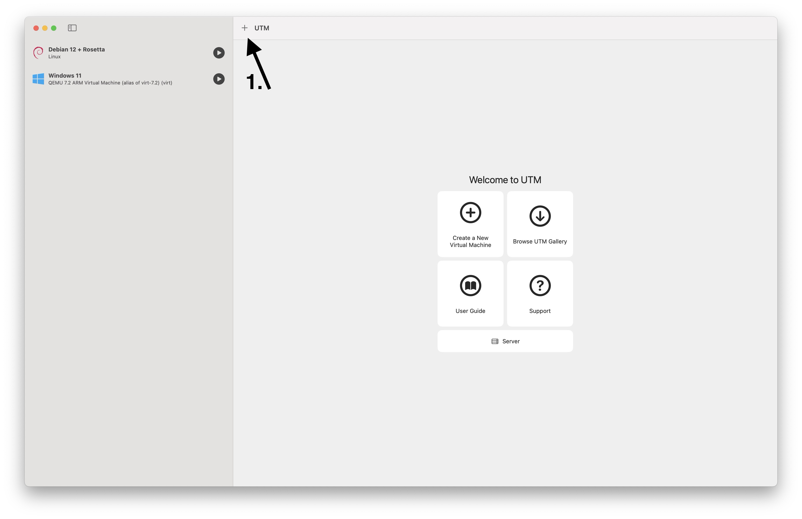

# Installing Vivado 2022.2 on macOS (Apple Silicon)
This might well work on older and/or newer versions of Vivado, but I only personally tested in with version 2022.2.
## Requirements
- M1 or newer chip
- min. 16GB of RAM
- min. 100GiB of free disk space
- [Homebrew](https://brew.sh)
## Pre-Setup
### UTM
We will use UTM to run our VM.  
Install UTM either through App Store (paid) or [GitHub](https://github.com/utmapp/UTM) (free).  
### openFPGALoder
We will use openFPGALoader do load the Bitstream onto our device, since UTM doesn't yet allow USB passthrough when using Apple Virtualization.  
```sh
brew install openfpgaloader
```
### Debian ISO
Get arm64 version of Debian from [here](https://www.debian.org/distrib/netinst).
## VM Setup

### Start
Choose Virtualize.
### Operating System
Choose Linux.
### Linux
Check "Use Apple Virtualization" and "Enable Rosetta (x86_64 Emulation)".  
Select Debian ISO for Boot ISO Image.
### Hardware
Choose whatever you can give the VM, but usually this should be 50% of the host RAM.  
You can leave the CPU Cores as Default.
### Storage
Vivado needs a lot of space for Installation, therefore I recommend at least 100GiB.  
UTM doesn't use all of this space right away, but instead only uses what it actually needs.
### Shared Directory
You can freely choose which Directory you want to share with the VM.  
This is where you'll be able to access the Bitstream files generated by Vivado.
### Summary
You can give the VM a more descriptive name, but other than that, just leave everything as is and click "Save".
## Debian Installation
In UTM, click the Play Button and start the VM.  
Go through the Debian installation like normal. Choose whichever Desktop Environment you prefer, it doesn't matter for our usage.  
Once reaching a functional desktop environment, we will install some packages.
### Clipboard sharing
```sh
sudo apt install spice-vdagent
```
### Rosetta (x86_64 Translation Layer)
#### Dependencies and mounting Rosetta
```sh
sudo apt install binfmt-support
sudo mkdir /media/rosetta
sudo mount -t virtiofs rosetta /media/rosetta
```
#### Mounting Rosetta on Startup
```sh
nano /etc/fstab
```
Add the following line to the end of the file
```sh
rosetta /media/rosetta virtiofs ro,nofail 0 0
```
#### Enabling Rosetta
```sh
sudo /usr/sbin/update-binfmts --install rosetta /media/rosetta/rosetta --magic "\x7fELF\x02\x01\x01\x00\x00\x00\x00\x00\x00\x00\x00\x00\x02\x00\x3e\x00" --mask "\xff\xff\xff\xff\xff\xfe\xfe\x00\xff\xff\xff\xff\xff\xff\xff\xff\xfe\xff\xff\xff" --credentials yes --preserve no --fix-binary yes
```
More information can be found in Apple's Developer Documentation [here](https://developer.apple.com/documentation/virtualization/running_intel_binaries_in_linux_vms_with_rosetta#3978496).
### Shared Directory
To be able to share the generated bitstream files with the host system, we need to mount a shared directory.  
That is the one you chose during the VM setup, but it can also be changed at any time after installation.  
To mount it in the VM we need to execute the following commands:
```sh
sudo mkdir /media/share
sudo mount -t virtiofs share /media/share
```
Same as Rosetta, to mount the share on startup, we modify the fstab file.
```sh
nano /etc/fstab
```
And add the following line.
```sh
share /media/share virtiofs rw,nofail 0 0
```
## Toolbox setup
We now have a Debian installation that can run amd64 binaries through Rosetta, but we still can't run Vivado, since the required dependencies would break the system, therefore we create a sandboxed container in which we can install all amd64 dependencies.
```sh
sudo apt install podman-toolbox
toolbox create -d debian -r 12
```
### Enable multiarch
**IMPORTANT: All of the following needs to be in the container.**
```sh
toolbox enter
sudo dpkg --add-architecture amd64
sudo apt update
```
## Vivado Installation
### Installing dependencies
```sh
sudo apt install locales-all:arm64 default-jre:amd64 libtinfo5:amd64 libncurses5:amd64 gcc:amd64
```
### Fixing the installer
Download the Linux Self Extracting Web Installer and navigate to the directory of the downloaded file in the shell.
```sh
chmod +x Xilinx_Unified_2022.2_xxxx_Lin64.bin
mkdir installer_files
./Xilinx_Unified_2022.2_xxxx_Lin64.bin --noexec --target installer_files/
cd installer_files/
nano xsetup
```
In the xsetup file, remove or comment out the following lines
```sh
# ERROR out if this installation is running on 32 bit OS 
# and does not support 32 bit installation 
if [ "$(uname -m)" != "x86_64" ]; then
    # check that the 32 bit library directory exist or not
    lnx32LibDir="${workingDir}/lib/lnx32.o"
    if [ ! -d $lnx32LibDir ]; then
           # terminate with an ERROR
       echo "ERROR: This installation is not supported on 32 bit platforms."
       exit 1;
    fi  
fi
```
You should now be able to run the installer like normal, without any special settings.
### Post-Installation Fixes
After installing, we need to apply the same fix as above to the installed Vivado instance.  
For that, navigate to the directory where you installed Vivado.
```sh
cd Vivado/2022.2/bin/
nano loader
```
Once again, remove or comment out the relevant lines for checking the OS architecture.
## Running Vivado
Since we installed Vivado in a container, we can't just run Vivado from the automatically created desktop shortcut.  
Instead, we always need to enter the terminal, from there enter the container with
```sh
toolbox enter
```
and then run
```sh
VIVADO_INSTALL_DIR/Vivado/2022.2/bin/vivado
```
## TODO: Loading Bitstream onto Device